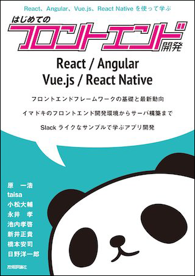

# version Upgrade情報 ＆ キャッチアップNote
- React v16.7 から「Hooks」が導入されることによって、「関数コンポーネント」でも「state, props」が扱えるようになっている。
- react-router-dom **v6**からreact-router型定義ファイルに「`export interface match`」がないようで[github.com/../react-router/index.tsx](https://github.com/remix-run/react-router/blob/main/packages/react-router-dom/index.tsx#L168)
  - たぶん「Hooks」の `useParams()`
などで URL params を扱う感じ。 
「Hooks」を使う際は、`functional components`で使う。 
(Classコンポーネントで扱うためには関数コンポーネントで一旦Classコンポーネントをラップして渡す...とClassコンポーネントでもpropsを受け取れるみたい...)

# 検討・キャッチアップリスト
- useState()
- useContext()
- etc..

参考URL
- [状態管理の選択肢 | ICS MEDIA](https://ics.media/entry/200409/#%E7%8A%B6%E6%85%8B%E7%AE%A1%E7%90%86%E3%81%AE%E9%81%B8%E6%8A%9E%E8%82%A2)
- [ReactのState管理を比較してみた | Qiita](https://qiita.com/cheez921/items/7c5f82da375a5988a179)
- [js.react.dev](https://ja.react.dev)

# Todo 
- G-Navエリア
- Containersエリア: 各部品を束ねるコンポーネント.
- Containers 
  - フィード(component)
    - props: ok
    - state: 2 
      - use context() (functional component)
  - フォーム(component): ok
    - stete: 1
      - context() か Redux.
- firebaseで簡易API
- API取得コンポーネント

[Commits履歴](https://github.com/ka2yuki/ChatApp-by-React/commits/main)

# 今回参考にした書籍情報

- 出版社: 技術評論社
- [Amazon URL](https://www.amazon.co.jp/React%EF%BC%8CAngular%EF%BC%8CVue-js%EF%BC%8CReact-Native%E3%82%92%E4%BD%BF%E3%81%A3%E3%81%A6%E5%AD%A6%E3%81%B6-%E3%81%AF%E3%81%98%E3%82%81%E3%81%A6%E3%81%AE%E3%83%95%E3%83%AD%E3%83%B3%E3%83%88%E3%82%A8%E3%83%B3%E3%83%89%E9%96%8B%E7%99%BA-%E5%8E%9F-%E4%B8%80%E6%B5%A9-ebook/dp/B07CY1Q6BR?crid=M48TMLURNP1G&dib=eyJ2IjoiMSJ9.KhCjPXDdBLt3wTFhgHYHZBoa51NzL1vt5E0_XiKnIJPjv8xIiyD5z0i6SG-HT7jlzGYobdZVPVzugQ5RByaSRHsqZOGljUUfkVdpRnx0sCmgIkNUeN8kV1_Alus1RegCife3q__OJPSS2zdLtr-_yc5op_GHjvBVxJBUhVaJlSmuebh2UJg_K4QDK3QZgoFpuink4IhfnhOZHNEiwW2RsjjmvfRst4VTHJyxKWgGsxe3jtPK18lJChUUKg7BgqB7MUaba199H3-X3x1t1UbERFJK1PXOhvuRk5O37KOXiJM.Vz9RWspymRGjCbmyUWiPcjyP6eGbVCi-3jMmHYGMPRA&dib_tag=se&keywords=%E3%81%AF%E3%81%98%E3%82%81%E3%81%A6%E3%81%AE%E3%83%95%E3%83%AD%E3%83%B3%E3%83%88%E3%82%A8%E3%83%B3%E3%83%89%E9%96%8B%E7%99%BA&qid=1721370550&sprefix=%E3%81%AF%E3%81%98%E3%82%81%E3%81%A6%E3%81%AE%E3%83%95%E3%83%AD%E3%83%B3%E3%83%88%E3%82%A8%E3%83%B3%E3%83%89%2Caps%2C1321&sr=8-1&linkCode=ll1&tag=ka2yukimori-22&linkId=46844d791f54f0a8b2eaa3609f500cd9&language=ja_JP&ref_=as_li_ss_tl)
  

---
# Getting Started with Create React App

This project was bootstrapped with [Create React App](https://github.com/facebook/create-react-app).

## Learn More

You can learn more in the [Create React App documentation](https://facebook.github.io/create-react-app/docs/getting-started).

To learn React, check out the [React documentation](https://reactjs.org/).
